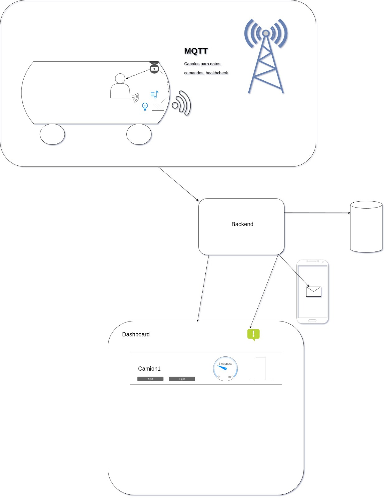

# AutoAwake-AI

## Descripción del Proyecto

AutoAwake AI es un sistema integral de control de flotas vehiculares diseñado para prevenir accidentes causados por la somnolencia al volante. La solución combina hardware IoT instalado en cada vehículo con una plataforma de gestión en la nube.

## Funcionalidades Principales

### En el Vehículo (Edge Computing)

En cada unidad se instala una Raspberry Pi con una cámara frontal que ejecuta un modelo de Inteligencia Artificial en tiempo real.

* **Detección de Somnolencia:** Análisis de visión por computadora para detectar ojos cerrados, cabeceo y micro-sueños.
* **Alertas Inmediatas:**

  * Activación de alarma sonora (buzzer).
  * Encendido de luz de emergencia.
  * Envío de alerta en tiempo real al backend.

### Plataforma Web (Backend & Frontend)

Panel administrativo para encargados de flota y logística.

* **Gestión de Flota:** Registro de vehículos, pilotos y su estado operativo.
* **Monitoreo en Tiempo Real:** Visualización de alertas con detalles como piloto, vehículo, ubicación (si aplica) y hora del evento.
* **Reportes y Analítica:** Historial de incidentes, tendencias de somnolencia, estadísticas por piloto y métricas de productividad.
* **Notificaciones:** Alerta inmediata vía web, correo o notificaciones móviles.

## Tech Stack

### Hardware & Edge AI

* Raspberry Pi (procesamiento local).
* Cámara frontal para reconocimiento facial.
* TensorFlow / TensorFlow Lite para inferencia en tiempo real.
* Buzzer y luz LED para alertas instantáneas.

### Backend

* Python
* FastAPI
* MySQL
* SQLAlchemy
* Pydantic

### Frontend

* HTML, CSS y JavaScript

## Arquitectura del Sistema

1. **Captura:** La cámara registra el rostro del conductor.
2. **Procesamiento:** La Raspberry Pi procesa los frames con el modelo TFLite.
3. **Acción Local:** Si hay somnolencia, se activa buzzer y luz de emergencia.
4. **Transmisión:** Se envía una alerta HTTP al backend.
5. **Persistencia:** El backend guarda los eventos en MySQL.
6. **Visualización:** El panel web consume la API para mostrar alertas y analítica.

## Documentación por Carpeta

Cada módulo del sistema cuenta con un archivo `README.md` propio que detalla su funcionamiento, dependencias y guías de despliegue:

* `backend/` – API, modelos, endpoints y configuración del servidor.
* `database/` – Esquemas SQL, migraciones y configuración de MySQL.
* `frontend/` – Dashboard, estructura web y flujo de usuario.
* `model-training/` – Entrenamiento del modelo de IA, datasets y pruebas.
* `raspberry/` – Código del dispositivo, inferencia, control de alertas y comunicación con backend.

## Diagrama de Arquitectura

El diagrama general del funcionamiento del sistema se encuentra en:



Incluye la interacción entre:

* Raspberry Pi (edge computing)
* Servidor FastAPI
* Base de datos MySQL
* Dashboard web

## Instalación y Uso

### Prerrequisitos

* Python 3.9+
* Docker y Docker Compose (recomendado)
* Raspberry Pi 4 para módulo vehicular

### Configuración del Backend

1. Clonar el repositorio.
2. Crear entorno virtual:
   `python -m venv .venv`
3. Activar entorno e instalar dependencias:
   `pip install -r requirements.txt`
4. Configurar archivo `.env`.
5. Iniciar servidor:
   `uvicorn main:app --reload`

### Despliegue de Base de Datos

```
docker run --name autoawake-db -e MYSQL_ROOT_PASSWORD=secret -p 3306:3306 -d mysql:latest
```

## Beneficios

* Prevención de accidentes por somnolencia.
* Control y visibilidad centralizada de toda la flota.
* Mejora en decisiones operativas, RRHH y logística.
* Implementación robusta con procesamiento local + nube.
